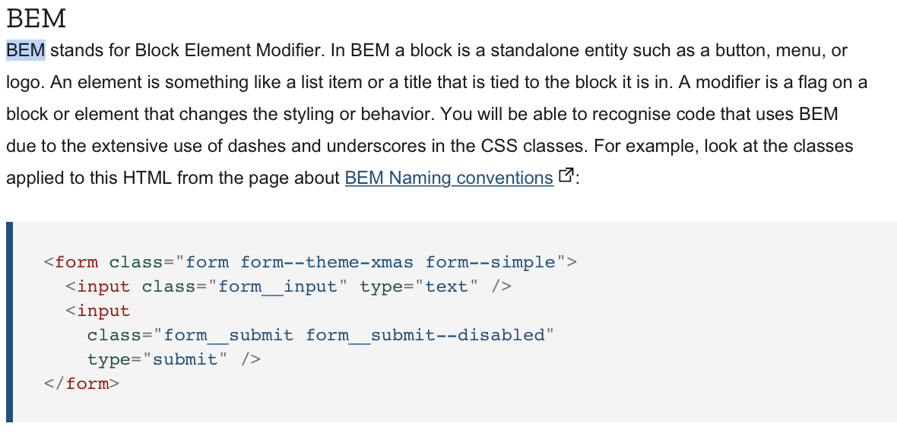

# Cocoatalk-actual

Git repo for cocoatalk webpage

## 1) Index html

- Web servers will look for this file, configured as default for most web servers.

## 2) Class name convention

- Parent\_\_child : This allows to know which parent + child is used

  - This is called "Block Element Modifier"
  - [Link to view](https://developer.mozilla.org/ko/docs/Learn/CSS/Building_blocks/Organizing)
  - [Link to view2](http://getbem.com/naming/)
  - **`This is to apply almost every element a class, so it is easy to access them`**
  - Example

    

    - html

      ```HTML
      <a classs="btn btn--big btn--orange" href="https://css-tricks.com">
        <span class="btn__price">$9.99</span>
        <span class="btn__text">Subscribe</span>
      </a>

      ```

      - btn : this is button
      - btn--big : this is a Big button
      - btn--orange : this has to be in orange
      - btn\_\_price : This is a price element under a button
      - btn\_\_text : This is a text element under a button

    - **`This allows the code to be read in more easier way`**

- Name "column" if too generic, use long names like this

## 3) Icons

- Icon site you can use
  - [HeroIcons](https://heroicons.com)
  - [FontAwesome : Fronts + Icons](https://fontawesome.com)
