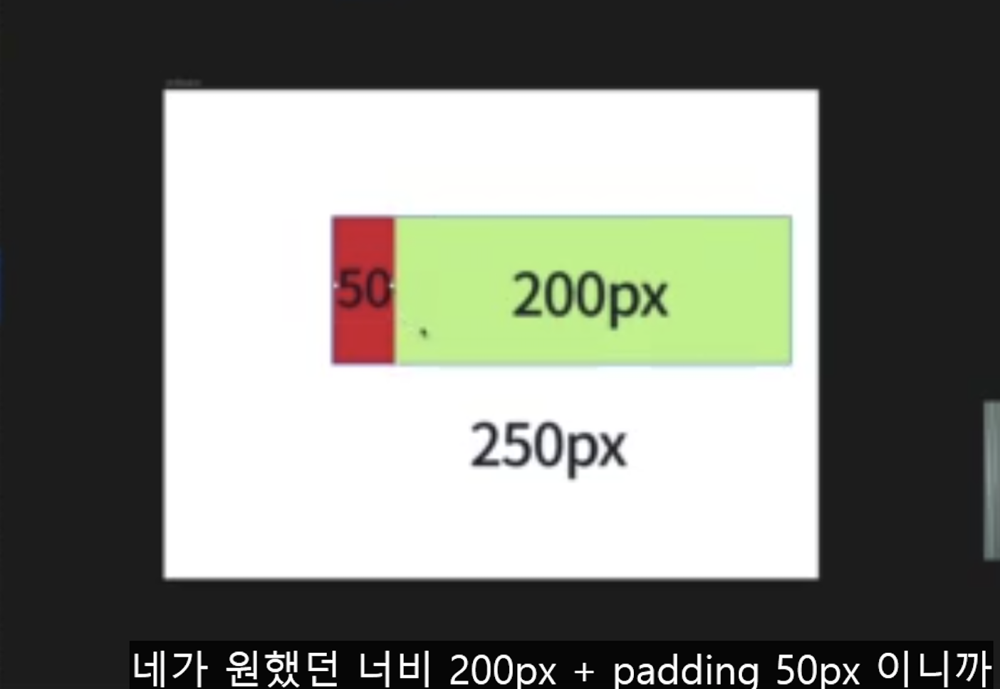
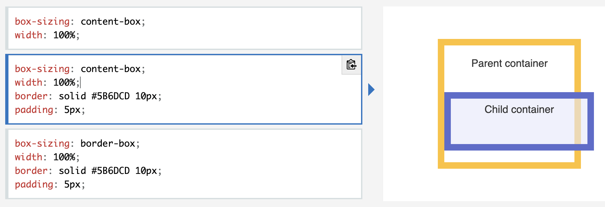
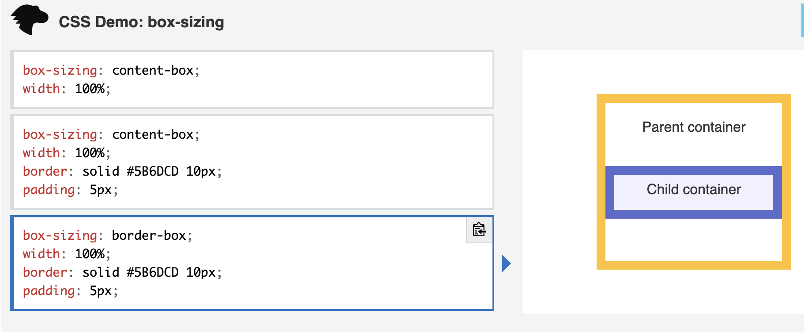

<link href="md_config/style.css" rel="stylesheet" />

# Cocoatalk - actual

Git repo for cocoatalk webpage

## 1) Position

- Fixed + (top, bottom, right, left) + (width, height)
- 요소가 표시되는 지점을 옮기는 것뿐

## 2) Box-sizing

 



<br>

- [참조링크 MDN](https://developer.mozilla.org/ko/docs/Web/CSS/box-sizing)
- Example

  ```CSS
    xxx {
      box-sizing: border-box;
    }
  ```

- 위 box-sizing 결과
  1. 결과적으로 padding 무시하도록 할 수 있게 됨
  2. padding / borderline 등을 쓰면 width, height가 정애진 상태에서 자동으로 그만큼 box 영역이 커지는데, 이를 방지할 수 있음
     - 보통 width, height는 원래 content 영역 크기를 지정하기 때문

## 3) flex and span

- Span 은 원래 width, height 줄 수 없는데, flex property 부과하면 줄 수 있게 됨  
  -> display: block / display: inline-block
