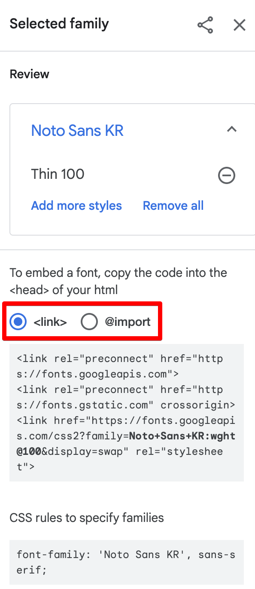
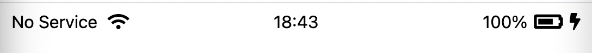
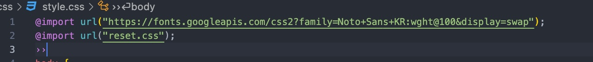
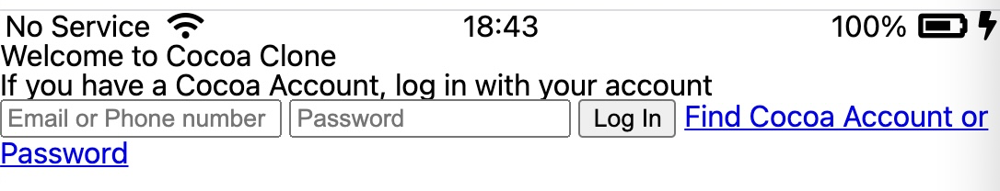
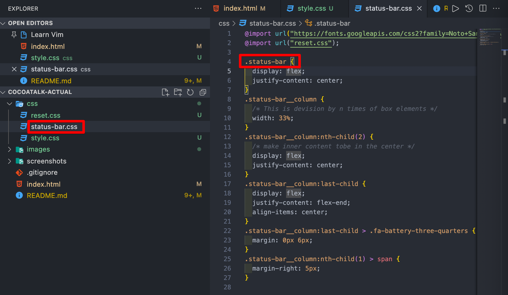
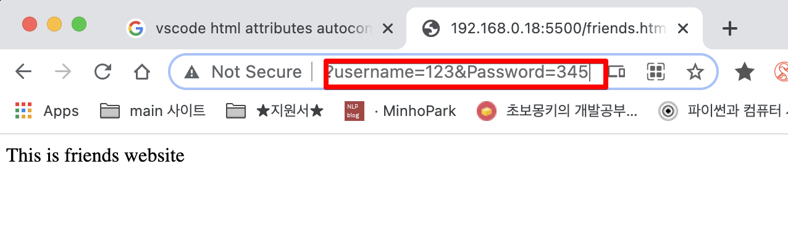

<link href="md_config/style.css" rel="stylesheet" />

# Cocoatalk-actual

Git repo for cocoatalk webpage

## 1) Index html

- Web servers will look for this file, configured as default for most web servers.

## 2) Class name convention

- Parent\_\_child : This allows to know which parent + child is used

  - This is called "Block Element Modifier"
  - [Link to view](https://developer.mozilla.org/ko/docs/Learn/CSS/Building_blocks/Organizing)
  - [Link to view2](http://getbem.com/naming/)
  - **`This is to apply almost every element a class, so it is easy to access them`**
  - Example

    

    - html

      ```HTML
      <a classs="btn btn--big btn--orange" href="https://css-tricks.com">
        <span class="btn__price">$9.99</span>
        <span class="btn__text">Subscribe</span>
      </a>

      ```

      - btn : this is button
      - btn--big : this is a Big button
      - btn--orange : this has to be in orange
      - btn\_\_price : This is a price element under a button
      - btn\_\_text : This is a text element under a button

    - **`This allows the code to be read in more easier way`**

- Name "column" if too generic, use long names like this

## 3) Icons

- Icon site you can use
  - [HeroIcons](https://heroicons.com)
  - [FontAwesome : Fronts + Icons](https://fontawesome.com)

## 4-1) CSS psudeo selectors

- Try to limit parent side first
- Example

  - CSS

    ```CSS
      .status-bar__column:nth-child(1) > span {
        margin-right: 5px;
      }

    ```

## 4-2) CSS not

- Use not syntax when you don't want something to happen for the CSS condition
- Example

  - Condition with "not" will be excluded from the CSS selector's selected element

  - HTML
    ```HTML
      <main class="welcome-main">
        <form id="login-form">
          <input type="text" placeholder="Email or Phone number" />
          <input type="text" placeholder="Password" />
          <input type="submit" value="Log In" />
          <a href="#">Find Cocoa Account or Password</a>
        </form>
      </main>
    ```
  - CSS
    ```CSS
      #login-form > input:not([type="submit"]) {
        /* margin-bottom: 12px; */
        /* padding-bottom: 12px; */
        /* padding: 13px 0px; */
        border: none;
        border-bottom: 1.5px solid rgba(0, 0, 0, 0.2);
        font-size: 18px;
        transition: border-bottom 0.5s ease-in-out;
      }
    ```
  - Result
    -> This will exclude the "Log in" input button

## 5) Font family

- Its good choice to start with -apple-font family
- **`If you add to many fonts, you will have a slow website; Use only fonts you will use`**
- You can also search google fonts, get embed

  - You can limk in your html
  - You can import in your CSS

  

## 6) Setting a element in the Center - CSS Hack

- This is weird but it works!
- Maybe in the future, study on CSS-grid
- How

  1. Divide the nav with number of items and give \% witdth, and flex-center
  2. give the element you want to place center a flex property
  3. and adjust other elements

  - Example

    - HTML
      ```HTML
        <div class="status-bar">
          <div class="status-bar__column">
            <span>No Service</span>
            <!-- To do! Wifi Icon -->
            <i class="fas fa-wifi"></i>
          </div>
          <div class="status-bar__column">
            <span>18:43</span>
          </div>
          <div class="status-bar__column">
            <span>100%</span>
            <!-- Todo! Battery Icon -->
            <i class="fas fa-battery-three-quarters fa-lg"></i>
            <!-- Lightenin Icon -->
            <i class="fas fa-bolt"></i>
          </div>
        </div>
      ```
    - CSS
      ```CSS
        .status-bar {
          display: flex;
          justify-content: center;
        }
        .status-bar__column {
          /* This is devision by n times of box elements */
          width: 33%;
        }
        .status-bar__column:nth-child(2) {
          /* make inner content tobe in the center */
          display: flex;
          justify-content: center;
        }
        .status-bar__column:last-child {
          display: flex;
          justify-content: flex-end;
          align-items: center;
        }
        .status-bar__column:last-child > .fa-battery-three-quarters {
          margin: 0px 6px;
        }
      ```
    - Result  
      

## 7) Icon from Font-awesome

- To enlarge give "fa-lg" or "fa-2x" properties
- Example

  - CSS
    ```CSS
      <i class="fas fa-battery-three-quarters fa-lg"></i>
    ```

## 8) Remove Browser init CSS styling

- This can be done with CSS
- [Link to see](https://abcdqbbq.tistory.com/9)
- Try to import CSS but not load them in the html
- Its better to maintain CSS in a CSS file
- Example

  - CSS
    
  - Result
    

## 9) CSS hierarchy



- Use CSS with naming conventions in the file-name too so that they are aligned.
- By doing this, you can divide CSS, and conquer each tags and have them intergrated in the top-CSS file.
- It's also a good choice to Add variable CSS to manage root level variables in html.

## 10) Text-align VS Flex-center

- If you are working with Text tags like p, h(n) tags; Just use text-align properties;

## 11) Inheritance

- You can give an element's css attribute value, a inhert.
- This will make the parent's base attribute move on the the child, the current one.
- Example
  - CSS
    ```CSS
      #login-form > a {
        text-align: center;
        text-decoration: none;
        color: inherit; /* This will inherit parent's attributes */
      }
    ```

## 12) Form other attributes

- action : What server location would you send the form inputs to
- method : GET / POST; GET uses string query, POST uses body and is more secure but requires a server.

- Example

  - HTML

    ```HTML
      <main class="welcome-main">
        <form action="friends.html" method="GET" id="login-form">
          <input name="username" type="text" placeholder="Email or Phone number" />
          <input name="password" type="text" placeholder="Password" />
          <input type="submit" value="Log In" />
          <a href="#">Find Cocoa Account or Password</a>
        </form>
      </main>
    ```

  - Result

      

    - Not good for security reasons, but sometimes good for displaying infos
